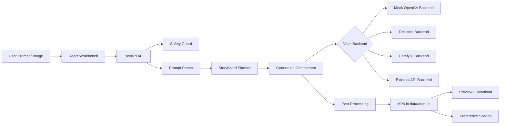

# AI Video Studio

AI Video Studio 是一个开源 AI 视频制作平台 MVP。它不是 Seedance、即梦、Runway、Kling 等闭源商业模型的复刻，而是以 FastAPI + React + 可替换 VideoBackend 为核心，把 prompt 解析、自动分镜、mock 文生视频、mock 图生视频、后处理、偏好评分、安全审查与真实模型后端接口封装成可运行、可扩展、可本地部署的工程骨架。

## 功能清单

- Prompt-to-Video 语义解析：中文/英文规则解析，输出结构化 JSON。
- Multi-shot Storytelling：自动生成 1-8 个镜头的分镜脚本。
- Text-to-Video：统一后端接口，默认 mock 可在 CPU 运行。
- Image-to-Video：参考图动画，支持 zoom/pan/tilt 等 mock 运镜。
- Keyframe Control：首尾帧校验与 mock 插值。
- Camera Motion：自然语言运镜解析与 OpenCV transform 参数。
- Temporal Consistency：帧差、闪烁、跳变与平滑分析。
- Character Consistency：角色卡与安全 prompt 注入，不做换脸克隆。
- Preference Scoring：多维评分框架，预留 Video RLHF 数据闭环。
- Inference Acceleration：CPU/CUDA/MPS 检测与 diffusers 优化开关。
- Post-production：resize、fps、字幕、多镜头合成、项目打包。
- Safety Guard：输入、角色和任务安全审查。

## 技术架构图



## 核心 skill 对照表

| Skill | 模块文件 | 当前实现 | 后续扩展 |
|---|---|---|---|
| Prompt-to-Video 语义解析 | prompt_parser.py | 规则解析 + 结构化 JSON | LLM parser |
| Text-to-Video | text_to_video.py | mock + diffusers 接口 | Wan/Hunyuan/CogVideoX |
| Image-to-Video | image_to_video.py | OpenCV 动画 + 接口 | I2V 模型 |
| Temporal Consistency | temporal_consistency.py | 帧差分析 | 光流/深度一致性 |
| Character Consistency | character_consistency.py | 角色卡 + prompt 注入 | reference encoder |
| Camera Motion | camera_motion.py | 运镜词解析 | camera trajectory control |
| Keyframe Control | keyframe_control.py | 首尾帧校验/插值 | native keyframe model |
| Multi-shot Storytelling | storyboard_planner.py | 自动分镜 | LLM storyboard agent |
| Video RLHF | preference_scoring.py | 多维评分框架 | reward model |
| Inference Acceleration | inference_acceleration.py | 设备检测/配置推荐 | distillation/quantization |
| Post-production | post_processing.py | ffmpeg/moviepy/OpenCV | 超分/补帧/音频 |

## 快速开始

```bash
git clone https://github.com/siner9586/aivideo.git
cd aivideo
make setup
make test
make api
# 新终端
make web
```

访问：`http://localhost:3000`。API 文档：`http://localhost:8000/docs`。

## 本地运行

后端：

```bash
PYTHONPATH=services/api uvicorn app.main:app --reload --host 0.0.0.0 --port 8000
```

前端：

```bash
cd apps/web
npm install
npm run dev
```

## Docker 运行

```bash
docker compose up --build
```

## API 示例

```bash
curl -X POST http://localhost:8000/api/parse \
  -H 'Content-Type: application/json' \
  -d '{"prompt":"生成一段 8 秒电影级写实风格视频：夜晚的中国传统茶楼，暖金色光线，镜头缓慢推进"}'

curl -X POST http://localhost:8000/api/generate/text-to-video \
  -H 'Content-Type: application/json' \
  -d '{"prompt":"生成 5 秒茶楼视频","backend":"mock","duration":5,"fps":12,"aspect_ratio":"16:9","resolution":"480p","camera_motion":"slow_push_in"}'
```

生成文件统一保存到 `data/outputs`。本次本地测试已生成示例：`data/outputs/*.mp4`。

## 前端使用说明

左侧输入 prompt、时长、画幅、分辨率、后端、运镜和负面提示词；中间查看语义解析 JSON 与自动分镜；右侧查看任务状态、视频预览、下载链接和后处理按钮。第一版图生视频上传接口已提供，UI 可继续接入 `/api/upload` 与 `/api/generate/image-to-video`。

## 如何接入真实视频生成模型

不要在代码中硬编码模型权重。使用 `.env`：

```bash
MODEL_BACKEND=diffusers
MODEL_PATH=/models/CogVideoX-or-Wan-or-HunyuanVideo
```

然后在 `services/api/app/backends/diffusers_t2v_backend.py` 或 `diffusers_i2v_backend.py` 中加载相应 pipeline。建议先用 `mock` 跑通全链路，再接入 AnimateDiff、CogVideoX、HunyuanVideo、Wan2.1/Wan2.2、LTX-Video/LTX-2 或 ComfyUI workflow。

## 安全与合规声明

本项目不得用于非自愿换脸、色情深伪、公众人物冒充、版权角色直接复刻、欺诈广告、政治误导、医疗金融虚假承诺或血腥极端内容。MVP 使用关键词与规则做基础安全审查；生产环境应接入更强的内容审核模型、人工复核和日志审计。

## 路线图

1. 完善图生视频前端上传与任务队列。
2. 接入 ComfyUI workflow JSON。
3. 增加真实 diffusers backend 示例。
4. 增加多候选生成与排序。
5. 增加字幕、音乐、封面和项目模板。
6. 增加用户空间、项目保存和权限控制。

## 常见问题

**没有 GPU 能跑吗？** 可以。默认 `mock` 后端仅依赖 OpenCV，能生成演示 mp4。

**这是商业视频大模型吗？** 不是。它是工程化平台 MVP，用于封装开源/远程后端。

**会自动下载大模型吗？** 不会。真实模型通过 `MODEL_PATH` 或后端配置接入。

## GitHub 推送说明

```bash
git add .
git commit -m "Build AI video studio MVP with modular generation skills"
git push origin main
```
