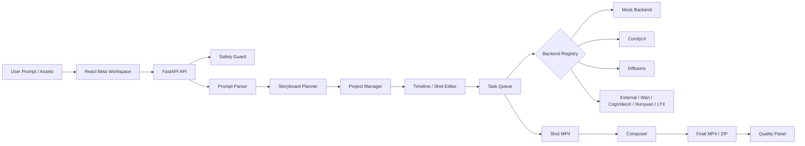

# AI Video Studio

AI Video Studio 是一个开源 AI 视频制作平台。Phase 1 已完成 FastAPI + React + mock backend 的基础闭环；Phase 2 将其升级为 Beta 工作台，加入项目化创作、任务队列、时间线分镜编辑、ComfyUI / Diffusers / 外部后端接口、素材库、视频合成、质量评估与部署文档。

它不是 Seedance、即梦、Runway、Kling 等闭源商业模型的复刻，也不包含任何大模型权重；它是一个可扩展工程框架，用于把 prompt 解析、分镜规划、视频生成后端、后处理与项目管理串成完整产品流程。

## Phase 2 Beta 核心功能

- 保留 Phase 1 mock 文生视频 / 图生视频闭环，默认仍可 CPU 运行。
- 新增轻量任务队列：内存队列 + `data/tasks/tasks.jsonl` 持久化。
- 新增项目系统：`data/projects/{project_id}/project.json` 保存完整视频项目。
- 新增前端 Beta 工作台：项目侧栏、模板库、素材库、时间线、队列、合成、质量面板。
- 新增 BackendRegistry：统一注册 `mock`、`comfyui`、`diffusers_t2v`、`diffusers_i2v`、`external`、`wan`、`cogvideox`、`hunyuan`、`ltx`。
- 增强 ComfyUI workflow 调用接口，支持 prompt / image 注入、提交、轮询、输出下载与 mock fallback。
- 增强 Diffusers 接口，支持环境变量配置和无模型 fallback。
- 新增 prompt 模板库与示例 prompt JSON。
- 新增素材库：图片、视频、音频上传与项目/镜头绑定。
- 新增视频合成：shot mp4 规范化、拼接、片头、片尾、项目 zip 导出。
- 新增质量评估：清晰度、亮度、帧间稳定性、时长匹配、安全分等启发式评分。
- 新增字幕与背景音乐接口占位。

## 技术架构



## 快速开始

```bash
git clone https://github.com/siner9586/aivideo.git
cd aivideo
make setup
make test
make api
# 新终端
make web
```

访问：

- 前端：`http://localhost:3000`
- API 文档：`http://localhost:8000/docs`

手动运行：

```bash
PYTHONPATH=services/api uvicorn app.main:app --reload --host 0.0.0.0 --port 8000
cd apps/web
npm install
npm run dev
```

## 当前支持的后端

| 后端 | 状态 | 说明 |
|---|---|---|
| `mock` | 默认可用 | CPU-only，生成演示 mp4 |
| `comfyui` | 接口可用 | 需本地 ComfyUI 与 workflow JSON |
| `diffusers_t2v` | 接口可用 | 需配置模型路径；默认 fallback |
| `diffusers_i2v` | 接口可用 | 需配置模型路径；默认 fallback |
| `external` | 骨架 | 用于商业或远程推理接口 |
| `wan` | 骨架 | 需用户自行配置模型路径 |
| `cogvideox` | 骨架 | 需用户自行配置模型路径 |
| `hunyuan` | 骨架 | 需用户自行配置模型路径 |
| `ltx` | 骨架 | 需用户自行配置模型路径 |

## 使用 mock backend

`.env` 或环境变量：

```bash
VIDEO_BACKEND=mock
```

API 示例：

```bash
curl -X POST http://localhost:8000/api/generate/text-to-video \
  -H 'Content-Type: application/json' \
  -d '{"prompt":"生成 5 秒茶楼视频","backend":"mock","duration":5,"fps":12,"aspect_ratio":"16:9","resolution":"480p","camera_motion":"slow_push_in"}'
```

## 创建项目与生成镜头

1. 打开前端 Beta 工作台。
2. 左侧点击“新建项目”。
3. 中间输入 prompt，点击“解析与生成分镜”。
4. 点击“写入项目时间线”。
5. 编辑每个 ShotCard 的 prompt、时长、运镜和后端。
6. 点击“生成单个镜头”。
7. 右侧 QueuePanel 查看状态。
8. 完成后点击 ComposerPanel 的“合成完整视频”。

对应 API：

```http
POST /api/projects
GET /api/projects
POST /api/projects/{project_id}/shots
POST /api/queue/submit
GET /api/queue/tasks
POST /api/composer/{project_id}/compose
POST /api/quality/evaluate
```

## 接入 ComfyUI

```bash
VIDEO_BACKEND=comfyui
COMFYUI_BASE_URL=http://127.0.0.1:8188
COMFYUI_WORKFLOW_PATH=examples/workflows/comfyui_text_to_video_example.json
```

说明文档：`docs/comfyui_integration.md`。

## 接入 Diffusers

```bash
VIDEO_BACKEND=diffusers_t2v
DIFFUSERS_MODEL_PATH=/models/your-video-model
DIFFUSERS_DEVICE=auto
ENABLE_CPU_OFFLOAD=true
ENABLE_ATTENTION_SLICING=true
ENABLE_VAE_TILING=true
```

说明文档：`docs/diffusers_integration.md` 与 `docs/real_model_setup.md`。

## 视频合成与导出

合成项目：

```bash
curl -X POST http://localhost:8000/api/composer/{project_id}/compose \
  -H 'Content-Type: application/json' \
  -d '{"title":"AI Video Studio","ending_text":"Created with AI Video Studio"}'
```

导出项目包：

```bash
curl -L http://localhost:8000/api/composer/{project_id}/export -o project.zip
```

## 素材库

支持格式：

- 图片：jpg、jpeg、png、webp
- 视频：mp4、mov、webm
- 音频：mp3、wav、m4a

API：

```http
POST /api/assets/upload
GET /api/assets
GET /api/assets/{asset_id}
DELETE /api/assets/{asset_id}
POST /api/projects/{project_id}/assets/{asset_id}
POST /api/projects/{project_id}/shots/{shot_id}/assets/{asset_id}
```

## 部署

详见 `docs/deployment_netlify_backend.md`。

支持：

1. 本地开发：FastAPI + Vite。
2. Netlify 前端：设置 `VITE_API_BASE_URL`。
3. 云服务器后端：持久化挂载 `data/`。
4. GPU 服务器：配置 ComfyUI / Diffusers。
5. 纯演示模式：只用 mock backend。

## 测试

```bash
PYTHONPATH=services/api pytest services/api/tests
cd apps/web
npm install
npm run build
```

如果视频合成相关测试失败，通常是 OpenCV/ffmpeg 环境问题。建议安装：

```bash
# macOS
brew install ffmpeg

# Ubuntu
sudo apt-get update && sudo apt-get install -y ffmpeg
```

## 重要目录

```text
services/api/app/queue/          # 任务队列
services/api/app/projects/       # 项目管理
services/api/app/backends/       # 后端注册与模型接口
services/api/app/skills/         # 模板、素材、合成、质量、字幕、音乐
services/api/app/routes/         # Beta API routes
apps/web/src/components/         # Beta 工作台组件
apps/web/src/lib/                # 前端 API 客户端
docs/                            # 集成与部署文档
examples/                        # workflow、项目与 prompt 示例
```

## 安全与合规声明

本项目不得用于非自愿换脸、色情深伪、公众人物冒充、版权角色直接复刻、欺诈广告、政治误导、医疗金融虚假承诺或血腥极端内容。生产环境应增加更强的内容审核、人工复核和日志审计。

不要提交：

- 大模型权重
- API Key / Token
- `.env`
- 私密素材
- `node_modules`
- `venv`
- `data/outputs` 大视频
- 临时缓存

## 路线图

- Phase 1：MVP 基础闭环
- Phase 2：Beta 工作台与模型后端
- Phase 3：真实模型深度集成与云端队列
- Phase 4：微信小程序 / 空间视频 / 3DGS 扩展
- Phase 5：商业化与多人协作
